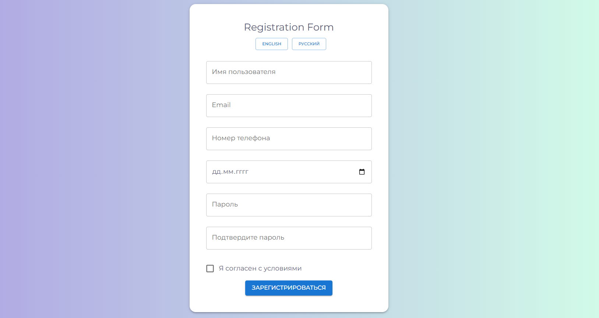

# Registration Form

Форма регистрации с валидацией полей через регулярные выражения на английском и русском языках.

## Deployment & Live Demo

[Deploy](https://tatyanazakiryanova.github.io/registration-form/)



## Technologies Used

- Typescript
- React
- Material UI

## Form Validation

- Все поля обязательны
- Соответствие формату email:
  - начинается и заканчивается на символы, которые не являются пробелами или @
  - содержит символ @, после которого идет доменное имя, а затем точка и доменное расширение
- Соответствие пароля:
  - должен быть от 6 до 20 символов
  - должен содержать хотя бы одну заглавную букву и цифру
- Соответствие формату номера телефона: первая цифра от 1 до 9, после первой цифры может идти от 1 до 14 цифр

## How to start project

in the project directory enter:

```js
npm install
```

and then run in dev mode:

```js
npm run dev
```

build the project:

```js
npm run build
```

production mode:

```js
npm run preview
```
